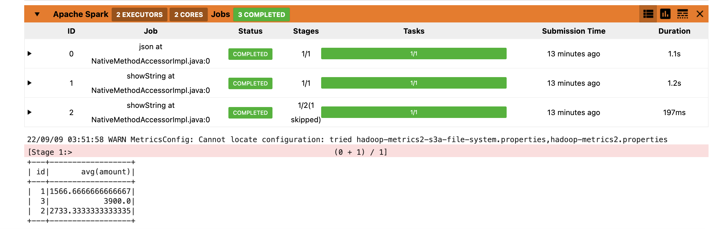

# spark-on-k8s

In this guide, we will setup spark with minio on kubernetes

## Pre-requisites
1. An existing kubernetes cluster
2. MINIO Installed in kubernetes in the namespace called minio
3. Optional - Download JDK 17 if testing locally
4. Optional - Install poetry for testing python code locally

For this demo, I am going to upload a json file from [here](data/orders.json) to a bucket called test-bucket in minio


## Getting started - Spark Installation locally
Download latest version of spark from [here](https://dlcdn.apache.org/spark/spark-3.3.0/spark-3.3.0-bin-hadoop3.tgz). Using spark 3.3.0 with scala-12 and hadoop-3.3. Add additional jars needed for aws-sdk and hadoop-3 (this will ensure that these JARs get copied over to docker image that we would be building under the section build base image)

``` 
tar xvzf spark-3.3.0-bin-hadoop3.tgz
sudo mv spark-3.3.0-bin-hadoop3 /usr/local/spark-3.3
export SPARK_HOME=/usr/local/spark-3.3
export PATH=$PATH:$SPARK_HOME/bin

cd /usr/local/spark-3.3/jars
wget https://repo1.maven.org/maven2/org/apache/hadoop/hadoop-aws/3.3.4/hadoop-aws-3.3.4.jar
wget https://repo1.maven.org/maven2/com/amazonaws/aws-java-sdk-bundle/1.12.298/aws-java-sdk-bundle-1.12.298.jar
```
 
 Add minio secrets and reference it later
```
kubectl create secret generic minio-api-client-credentials  \
    --from-literal=MINIO_HOST_URL="<MINIO_SVC_HOST_NAME>:9000" \
    --from-literal=MINIO_ACCESS_KEY="YourAccessKey" \
    --from-literal=MINIO_SECRET_KEY="YourSecretKey" \
    -n minio 
```


## Local testing and base images

### Quick Test Locally (to check if spark JARs and minio are working fine)
```
poetry install
export SPARK_LOCAL_IP=<Local IP>
spark-submit spark_on_k8s/main.py --master=local[1]
```

### Build Base Image
```
cd dev/base_spark_image
chmod +x build_base_image.sh && ./build_base_image.sh
```


### Build Spark Notebook Image
```
cd dev/base_notebook_image
chmod +x build_spark_notebook.sh && ./build_spark_notebook.sh
```


## Spark Notebook
Make sure to install in the same namespace where minio is installed
Inspired by blog posted by [Itay Bittan](https://towardsdatascience.com/jupyter-notebook-spark-on-kubernetes-880af7e06351)
```
kubectl apply -f dev/spark-notebook.yaml -n minio
```
See sample notebook under [here](notebook/spark-k8s-test.ipynb). If everything works fine, you should get a monitor like below




### Test Spark Image
```
$SPARK_HOME/bin/spark-submit \
    --master k8s://https://<KUBE CLUSTER IP>:16443 \
    --deploy-mode cluster \
    --name spark-submit-examples-sparkpi \
    --conf spark.executor.instances=3 \
    --conf spark.kubernetes.authenticate.driver.serviceAccountName=jupyter \
    --conf spark.kubernetes.namespace=minio \
    --class org.apache.spark.examples.SparkPi \
    --conf spark.kubernetes.container.image=vensav/spark:3.3.0-scala_2.12-jre_17-slim-buster \
     local:///opt/spark/examples/jars/spark-examples_2.12-3.3.0.jar 80
```

### Cleaning up if needed
`kubectl delete pods -l  spark-app-name=test-app -n minio`


## Using Spark-Operator on k8s

### Install using helm
```
# https://github.com/GoogleCloudPlatform/spark-on-k8s-operator
helm repo add spark-operator https://googlecloudplatform.github.io/spark-on-k8s-operator
helm install spark-operator spark-operator/spark-operator --namespace spark-operator --create-namespace 
```

## Build and test Pyspark code using spark operator
Note:- Uses the jupyter service account that is defined when deploying notebook
```
poetry export --without-hashes --format=requirements.txt > dev/requirements.txt
chmod +x dev/spark-operator-create-driver.sh && dev/spark-operator-create-driver.sh
kubectl apply -f dev/spark-operator-python-test.yaml -n minio
```
Unlike spark notebook above where sparkmonitor is currently not supported on scala 2.13, operator seems to work fine on both scala-2.12 and scala-2.13 images


## Using spark-submit on k8s instead of using operator
```
$SPARK_HOME/bin/spark-submit \
    --master k8s://https://<KUBE CLUSTER IP>:16443 \
    --deploy-mode cluster \
    --name pyspark-submit-test \
    --conf spark.executor.instances=3 \
    --conf spark.driver.cores=1  \
    --conf spark.driver.memory=1g \
    --conf spark.executor.cores=2 \
    --conf spark.executor.memory=2g  \
    --conf spark.kubernetes.authenticate.driver.serviceAccountName=jupyter \
    --conf spark.kubernetes.namespace=minio \
    --conf spark.kubernetes.container.image=vensav/spark-operator-driver:3.3.0-scala_2.12-jre_17-slim-buster \
    --conf spark.kubernetes.driver.secretKeyRef.S3_HOST_URL=minio-api-client-credentials:MINIO_HOST_URL \
    --conf spark.kubernetes.executor.secretKeyRef.S3_HOST_URL=minio-api-client-credentials:MINIO_HOST_URL \
    --conf spark.kubernetes.driver.secretKeyRef.S3_ACCESS_KEY=minio-api-client-credentials:MINIO_ACCESS_KEY \
    --conf spark.kubernetes.executor.secretKeyRef.S3_ACCESS_KEY=minio-api-client-credentials:MINIO_ACCESS_KEY \
    --conf spark.kubernetes.driver.secretKeyRef.S3_SECRET_KEY=minio-api-client-credentials:MINIO_SECRET_KEY \
    --conf spark.kubernetes.executor.secretKeyRef.S3_SECRET_KEY=minio-api-client-credentials:MINIO_SECRET_KEY \
     local:///app/spark_on_k8s/main.py
```


## Building Images from scratch (yet to be tried)
Idea is to do something like below -
- https://kienmn97.medium.com/deployment-of-standalone-spark-cluster-on-kubernetes-ba15978658bf
- https://github.com/KienMN/Standalone-Spark-on-Kubernetes/blob/master/images/spark-ui-proxy/Dockerfile

